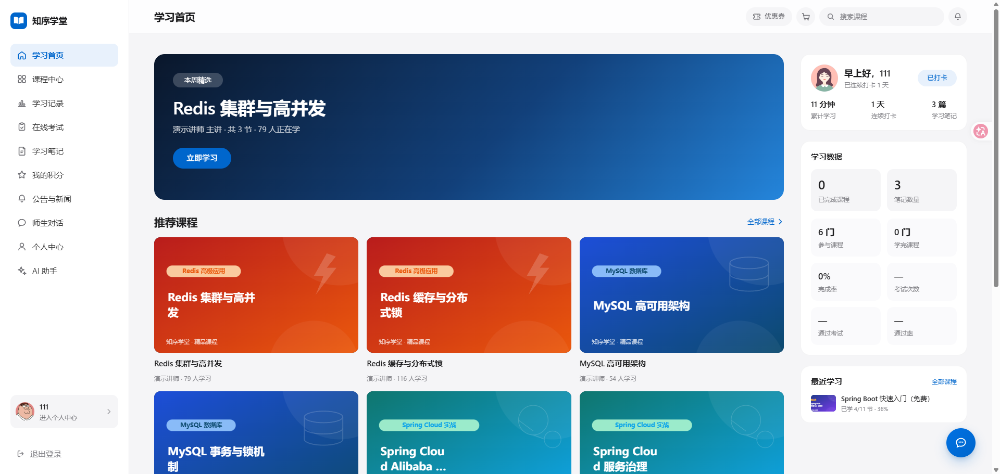
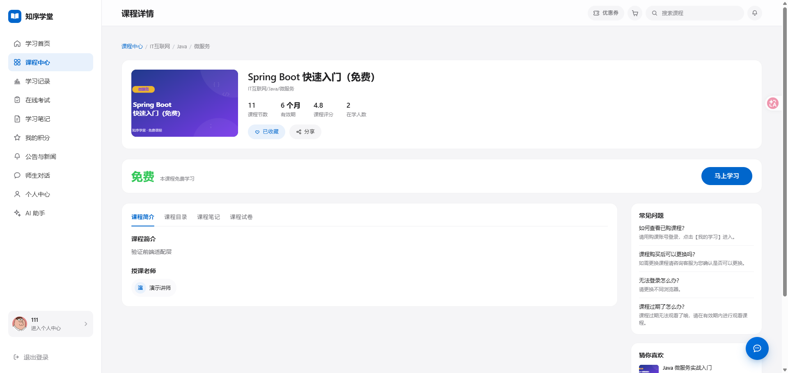
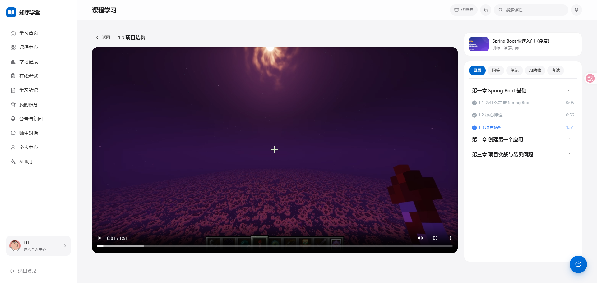
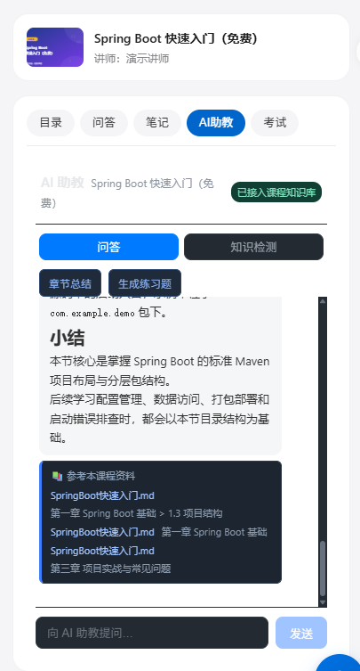
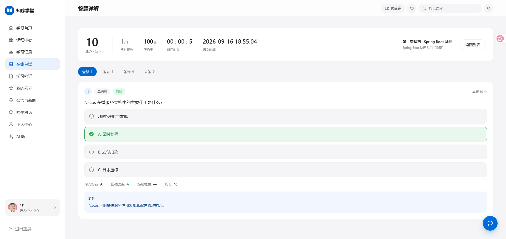
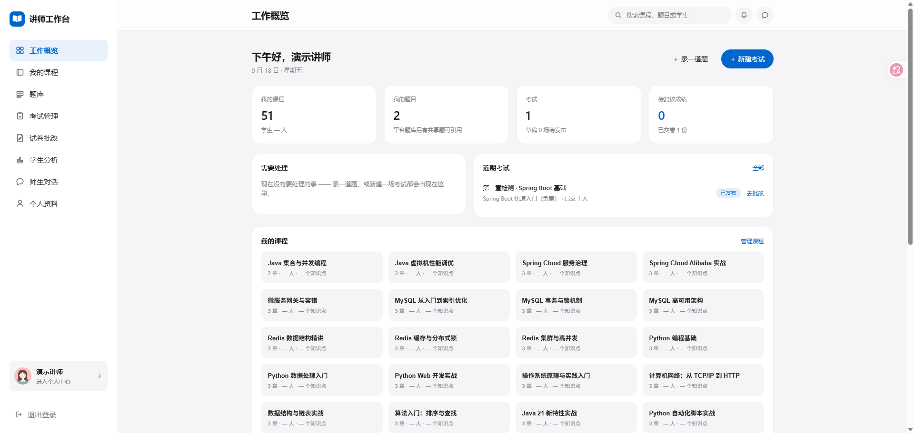
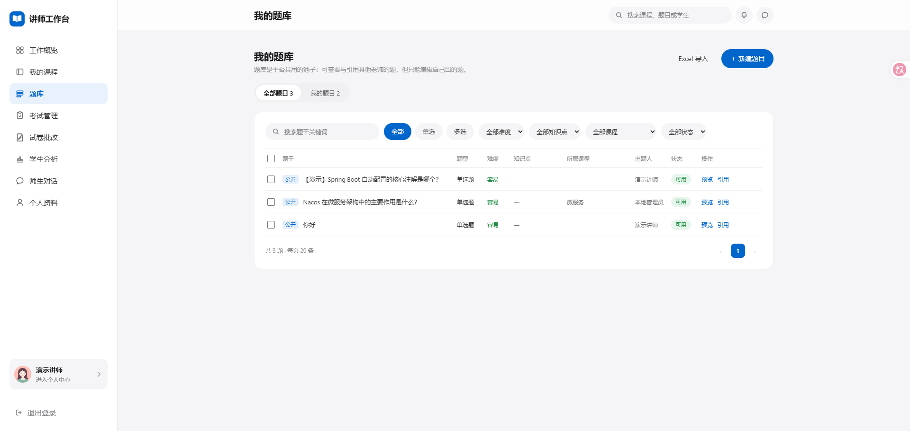

# 知序学堂 · Zhixu Academy

一个**可本地一键启动**的在线教育微服务平台：把「课程浏览 → 学习 → 考试 → 讲师建课 → 题库与组卷 → 批改与统计 → 课程文档问答」串成一条完整可演示的链路。

> ### 📌 项目来源与完成方式（重要）
>
> **代码基座**：本项目起步于开源教学项目 **「天机学堂」** 的微服务骨架（其痕迹仍保留在运行时契约中 —— `com.tianji.pay.*`、`tj-*` 模块名、Nacos 服务注册名，这些是运行时标识，为保证编排可用而**刻意不改名**，README 开篇说明以免误解）。
>
> **在此之上完成的增量工作**：学员端全站重构（24 个页面 / 21 条路由）、讲师工作台从 0 到 1（17 个页面 / 15 条路由 / 10 项导航全部实装）、考试与题库链路重建（作答快照判分、公开可见范围、批改闭环）、公告收件箱与未读体系、视频链路本地化，以及贯穿全链路的 AI 能力接入。
>
> **AI 深度参与**：从产品口径定义、数据模型取舍、接口契约设计，到缺陷根因定位与回归验证，全流程由 AI 辅助完成。**所有关键决策、业务口径和验收标准均由人工确认**；每一轮改动都留下可追溯的过程复盘（见 [工程过程](#工程过程)）。

```
15 个 Java 微服务 · 390 个 REST 端点 · 1061 个后端文件 / 63040 行
1 个 Vue 3 SPA 承载双端 · 55 个 js + 159 个 vue / 56040 行
23 个容器（16 应用 + 7 基础设施）· 14 份数据库迁移脚本
```


> 当前仓库只提供本地 Docker Compose 启动方式。目录名与服务注册名中的 `tj-*` / `tianji-*` 是运行时契约，保持不变以确保现有编排和 Nacos 配置可直接工作。

---

## 界面演示

> 截图位于 `docs/screenshots/demo/`。截图清单与待补项见该目录的 `README.md`。

### 学员端

| 首页（分类 + 课程卡） | 课程详情（介绍 / 目录 / 讲师） |
| --- | --- |
|  |  |

| 学习页（视频 + 目录 / 问答 / 笔记 / AI助教 / 考试 五个页签） | 同上·右栏 —— AI 助教：流式回答 + **引用来源标注** |
| --- | --- |
|  |  |

**考试链路 · 交卷后的成绩与逐题解析**（判分只读作答时冻结的快照）



### 讲师工作台

| 工作概览（左侧 10 项导航 + 数据卡） | 题库管理（含「可见范围」：私有 / 公开到平台） |
| --- | --- |
|  |  |

> 建课向导、新建考试 / 组卷、主观题批改、考试统计、师生对话等界面截图见
> `docs/screenshots/demo/README.md` 的清单（可选补充，不影响阅读）。

---

## 功能一览

### 学员端（21 条路由，全部为真实页面，零占位）

- **发现**：首页分类导航、课程检索与自动补全、搜索历史、课程详情、课程目录
- **学习**：视频播放（本地媒资直链）、目录进度、笔记、问答、收藏、学习时长与热力图
- **考试**：视频页「考试」页签 + 课程详情「课程试卷」→ 在线答题（答题卡、倒计时、交卷幂等）→ 成绩与逐题解析
- **AI 助教**：课程文档问答（SSE 流式输出、引用来源标注）、学习工具（笔记整理 / 知识检测）、知识库文档管理
- **个人**：资料与本地头像、我的课程、订单与购物车、优惠券、积分与签到、公告与新闻（未读体系）

### 讲师工作台（15 条路由，10 项导航全部实装）

- **工作概览**：课程数 / 题目数 / 待批改等真实数据卡
- **课程管理**：我的课程、4 步建课向导（基本信息 → 目录 → 视频 → 上架）、协作讲师按平台账号添加
- **题库**：录题（单选 / 多选）、批量操作、**可见范围**（私有 / 公开到平台题库）、被引用的题禁止撤回
- **考试**：新建考试（关联课程 → 组卷 → 发布）、发布状态管理
- **批改与统计**：待批改列表、主观题判分、考试统计（正确率、逐题分布）
- **师生对话**：WebSocket 私信
- **学生分析 / 个人资料**

> **登录守卫**：`/teacher/*` 需登录态（无 token 跳登录页，登录后回到原页）；学员端课程列表与详情允许匿名浏览。

### AI 能力

完整 RAG 工程链路：**上传资料 → 结构化分块 → Embedding 向量化 → pgvector 持久化 → 向量召回（粗排 topK）→ BGE 重排（精排 topN）→ 大模型生成 → SSE 流式输出**。

叠加工程化设计：多用户数据隔离（文件 / 向量块 / 会话 / 聊天记录按 userId 隔离）、同名文件判重、失败降级（向量库不可用时回退关键词检索，rerank 失败时回退原排序）、学习工具走全量资料上下文（非 RAG 路径）。

---

## 技术栈

| 层 | 选型 |
| --- | --- |
| 后端 | Java 11 · Spring Boot 2.7 · Spring Cloud 2021 · Spring Cloud Alibaba · Nacos · OpenFeign · MyBatis-Plus |
| 前端 | Vue 3 · Vite · Element Plus · SCSS · Hash 路由 · 双端（学员端 / 讲师端）同 SPA 分布局 |
| 数据 | MySQL 8 · Redis · Elasticsearch · pgvector（PostgreSQL 16） |
| 中间件 | RabbitMQ · Nginx |
| AI | LangChain4j · DeepSeek（对话）· SiliconFlow BGE-M3（向量）· BGE-reranker-v2-m3（重排） |
| 部署 | Docker Compose（16 应用容器 + 7 基础设施容器） |

---

## 快速开始

前置条件：Docker Desktop（Linux containers）、Git、JDK 11 和 Maven。仅运行已构建镜像时不需要 Node.js；修改前端时再安装 Node.js 16+。

1. 创建本地环境文件：

```powershell
Copy-Item deploy/.env.example deploy/.env
```

2. 启动基础设施（MySQL、Redis、RabbitMQ、Nacos、Nginx）：

```powershell
docker compose --env-file deploy/.env -f deploy/docker-compose.yml up -d
docker compose --env-file deploy/.env -f deploy/docker-compose.yml ps
```

3. 构建 Java 服务并启动：

```powershell
mvn -DskipTests package
docker compose --env-file deploy/.env -f deploy/docker-compose.yml -f deploy/docker-compose.services.yml up -d --build
```

4. 如需启用搜索，追加 `search` profile（会启动 Elasticsearch、索引初始化和 search-service）：

```powershell
docker compose --env-file deploy/.env --profile search -f deploy/docker-compose.yml -f deploy/docker-compose.services.yml up -d --build search-service
```

停止本地环境：

```powershell
docker compose --env-file deploy/.env --profile search -f deploy/docker-compose.yml -f deploy/docker-compose.services.yml down
```

首次创建 MySQL 数据卷时，`deploy/mysql/init/` 会自动导入数据库、表和演示数据。已有数据卷升级时，可重复执行迁移脚本：

```powershell
docker cp deploy/mysql/init/20-demo-mvp.sql tianji-local-mysql-1:/tmp/20-demo-mvp.sql
docker exec tianji-local-mysql-1 sh -c "mysql -uroot -p1234 --default-character-set=utf8mb4 < /tmp/20-demo-mvp.sql"
```

---

## 访问与演示账号

| 入口 | 地址 |
| --- | --- |
| 前端（学员端 / 讲师端同一入口） | [http://localhost:18082/](http://localhost:18082/) |
| API Gateway | http://localhost:10010 |
| Nacos 控制台 | [http://localhost:8848/nacos](http://localhost:8848/nacos) |
| RabbitMQ 管理台 | http://localhost:15672 |
| Elasticsearch | http://localhost:19200 |
| Nginx 健康检查 | [http://localhost/healthz](http://localhost/healthz) |
| MySQL 宿主机端口 | localhost:13306（容器内 3306） |

| 账号 | 密码 | 角色 |
| --- | --- | --- |
| `admin` | `123456` | 平台管理员 |
| `teacher` / `teacher2` | `123456` | 讲师（进入 `/teacher/*` 工作台） |
| `demo` | `123456` | 学员（**推荐用它走完整演示**，数据干净） |

建议验收顺序：**登录 → 首页 → 课程详情 → 学习页（视频 / 目录 / 笔记 / AI 助教 / 考试）→ 在线答题 → 成绩解析 → 切讲师账号进工作台 → 建课 → 题库 → 组卷发考试 → 批改 → 统计**。

---

## 项目结构

```text
deploy/                   Docker Compose、Nacos、MySQL / 搜索初始化、迁移脚本
tj-api/                   跨服务共享的 DTO、Feign Client、缓存
tj-common/                通用能力（异常、响应包装、用户上下文、分页）
tj-auth/  tj-user/        认证鉴权、用户与讲师资料
tj-course/ tj-learning/   课程、目录、媒资绑定、学习记录、笔记、问答
tj-exam/                  题库、试卷、考试、作答快照与判分
tj-message/               公告、收件箱、师生对话（多模块：domain / service）
tj-media/ tj-search/      媒资签名、检索与推荐
tj-remark/ tj-data/       评价、数据统计
tj-trade/ tj-promotion/   订单、购物车、优惠券
tj-pay/                   支付（本地为配置占位，未接入真实商户）
tj-ai/                    文档问答（RAG）、会话、知识库
tj-front/tj-protal/       Vue 3 前端（学员端 + 讲师端同 SPA）
docs/screenshots/demo/    README 演示截图
assets/readme/            README 架构图
```

---

## 工程过程

本项目的每一轮改动都留下了**可追溯的过程复盘**（需求 → 根因 → 修复 → 验证），放在仓库根目录。其中与架构和口径强相关的几份：

| 文档 | 内容 |
| --- | --- |
| `p11-teacher-api-contract.md` | 讲师端接口契约（含与后端的字段口径映射） |
| `p14-answer-grading-pipeline.md` | 作答与判分链路（快照冻结、答案归一、交卷幂等） |
| `p16-teacher-question-bugfix.md` | 题库三个 bug 的根因与修复（含脏数据导致整页 500 的教训） |
| `p17-exam-only-redesign.md` | 考试口径重设计（取消随堂练习，以课程为维度） |
| `p19-auth-hardening.md` | 鉴权加固（修复试卷答案泄漏、归属校验下沉） |
| `p22-chat.md` / `p23-video-local.md` | 师生对话（WebSocket）/ 视频链路本地化 |
| `p30` / `p31` | 媒资绑定口径统一、上架 SQL 漏同步媒资的真凶定位 |
| `p33-project-status-and-todo.md` | 项目现状盘点 + 待办清单 + 简历向总结 |
| `p35-notice-unread.md` | 公告"点了还是未读"——两个叠加缺陷的定位 |
| `p36-full-project-audit.md` | 全项目体检（编译 / 静态校验 / 接口契约 / 数据 / 敏感信息） |

可讲的技术难点（均为过程中实际定位的问题，非框架罗列）：复活一个**从未成功构建过**的服务（表象缺云凭证，根因模块漏依赖）、定位「改了却看不到」的隐蔽同步缺陷（`ON DUPLICATE KEY UPDATE` 更新列表漏列且不报错）、规避网关 Range 转发的损坏、学习行为埋点的**防刷口径设计**、以及修复一处**试卷答案泄漏**并把归属校验下沉到服务层。

---

## 未完成清单（Roadmap）

> 以下为**已知未做**的功能，按优先级排列，均不影响现有演示链路可用性。

### 第一档 · 收尾性质 —— ✅ 已完成

文案统一为「讲师」、清理占位组件、讲师端登录守卫、上架「进行中」反馈。详见 `p34-tier1-cleanup.md`。

### 第二档 · 功能缺口（后端未实现）

| # | 事项 | 说明 |
| --- | --- | --- |
| 1 | **题库 Excel 批量导入** | 讲师侧最大的效率瓶颈；前端入口已就位，后端未实现 |
| 2 | 题目 ↔ 知识点关联 | 知识点是课程级资产，但题目关联表未建 → 页面该位置显示「—」 |
| 3 | 讲师端「学生分析」补学习时长列 | 数据源已具备，只差接口字段 + 一列展示 |
| 4 | 逐小节学习明细视图 | 数据结构已在，视图未做 |
| 5 | 题库**使用信号 + 众包纠错** | 平台公共题库目前没有任何质量机制（无使用量、无纠错入口） |
| 6 | 定时发布 | `course` 表缺「定时公开时间」字段 |
| 7 | 知识库文档编辑端点 | `PUT /ct/file/update` 后端不存在，学员端保存编辑必失败（见 `p36` §2.2） |

### 第三档 · 工程债

| # | 事项 | 说明 |
| --- | --- | --- |
| 1 | 媒资文件无自动清理 | 目前靠手工清理（已清过两轮共约 1.4GB） |
| 2 | 历史半截数据 | 少量早期课程数据不完整、2 道历史题分类为空（其中 `9001` 解析乱码） |
| 3 | 热力图无历史 | 学习时长埋点是新加的，更早的行为没有数据 |
| 4 | 老站路由仍挂载 | `legacy.js` 13 条路由指向已被取代的旧页面，其中若干接口后端已不存在（见 `p36` §3.2） |
| 5 | 无引用的死函数 | `api/*.js` 中约 10 个导出函数无调用点（见 `p36` §3.1） |

---

## 已知限制

- **仅支持本地部署**，没有公网在线 Demo；GitHub 访问者无法直接访问开发机的 `localhost`。
- **第三方服务为配置占位**：微信 / 支付宝支付、真实短信、云媒资、对象存储均未接入，不作为本地验收依赖。
  - 其中 `pay-service` 因为启动即需要微信支付私钥（缺失则 `PemUtil` NPE），在未配置证书时容器会处于重启状态 —— 它不影响其它功能，建议 `docker compose stop pay-service` 让它安静停着。
- **AI 能力依赖外部 Key**：`DEEPSEEK_API_KEY` 缺省时对话不可用；`TJ_AI_EMBEDDING_MODEL` 留空时关闭向量检索、退化为本地关键词召回；`TJ_AI_RERANK_MODEL` 留空时关闭重排。填齐后自动启用完整 RAG 链路。
- **AI 回答的边界**：知识库未命中时允许模型基于通用知识做补充回答（这是与产品方确认过的定位，不是缺陷）；检索质量评估集（hit rate）与会话持久化仍在计划中。
- 定位为**本地演示版**：单实例部署，无分布式向量库、无鉴权审计 —— 这些是生产化差异，不是功能缺失。

---

## 致谢

- 代码基座来自开源教学项目 **天机学堂**，其微服务分层、通用能力与领域模型为本项目提供了起点。
- AI 能力依赖 **DeepSeek**（对话生成）与 **SiliconFlow** 提供的 **BGE-M3 / BGE-reranker-v2-m3**（向量与重排）。
- 本项目的需求拆解、设计取舍、编码实现与缺陷定位大量借助 AI 协作完成。

## License

仅用于学习与求职作品展示。
