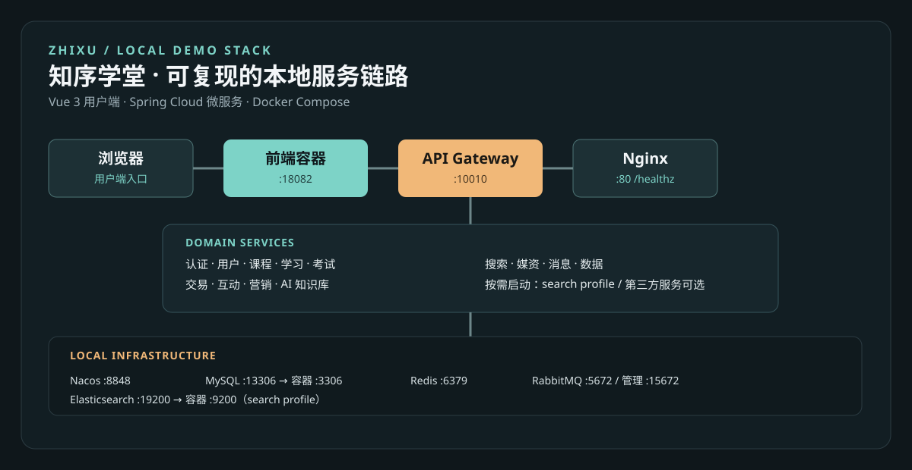

# 知序学堂

知序学堂是一个可在本机运行的在线教育微服务系统。它把课程浏览、学习、交易、个人中心和课程文档问答串成一条可操作的演示链路，适合作为后端微服务与 AI 应用的项目展示。



> 当前仓库只提供本地 Docker Compose 启动方式。目录和服务注册名中的 `tj-*` / `tianji-*` 标识是运行时契约，保持不变以确保现有编排和 Nacos 配置可以直接工作。

## 当前能力

- 账号登录、手机号本地 Mock 注册、个人资料与本地头像预览
- 首页分类、课程检索、自动补全、搜索历史、课程详情和课程目录
- 免费课程报名、收费课程加入购物车、创建待支付订单
- 笔记、课程评价、收藏、优惠券、积分签到、积分榜和个人中心
- LangChain4j + DeepSeek 的课程文档问答：支持 Markdown/TXT 上传、本地文件持久化、文本检索、普通请求问答、会话创建与历史恢复
- 本地 MySQL、Redis、RabbitMQ、Nacos、Elasticsearch 及 Java 服务的 Compose 编排

### AI 功能是否足够展示

足够作为当前简历项目的 AI 功能亮点：已经形成“上传课程资料 → 建立本地知识上下文 → 提问 → 返回基于资料的答案 → 恢复会话”的完整闭环，能直观展示 RAG 应用的核心流程。当前实现定位是本地演示版，使用文本检索和普通请求，不等同于生产级向量数据库、权限隔离、流式输出或高并发服务。

## 技术栈

Java 11 · Spring Boot 2.7 · Spring Cloud 2021 · Spring Cloud Alibaba · MyBatis-Plus · Vue 3 · Vite · MySQL 8 · Redis · RabbitMQ · Nacos · Elasticsearch · LangChain4j · DeepSeek · Docker Compose

## 本地启动

前置条件：Docker Desktop（Linux containers）、Git、JDK 11 和 Maven。仅运行已构建镜像时不需要 Node.js；修改前端时再安装 Node.js 16+。

1. 创建本地环境文件：

```powershell
Copy-Item deploy/.env.example deploy/.env
```

2. 启动基础设施（MySQL、Redis、RabbitMQ、Nacos、Nginx）：

```powershell
docker compose --env-file deploy/.env -f deploy/docker-compose.yml up -d
docker compose --env-file deploy/.env -f deploy/docker-compose.yml ps
```

3. 构建 Java 服务并启动用户端所需服务：

```powershell
mvn -DskipTests package
docker compose --env-file deploy/.env -f deploy/docker-compose.yml -f deploy/docker-compose.services.yml up -d --build auth-service user-service course-service exam-service learning-service trade-service remark-service promotion-service ai-service gateway-service frontend
```

4. 如需启用搜索，追加 `search` profile（会启动 Elasticsearch、索引初始化和 search-service）：

```powershell
docker compose --env-file deploy/.env --profile search -f deploy/docker-compose.yml -f deploy/docker-compose.services.yml up -d --build search-service
```

停止本地环境：

```powershell
docker compose --env-file deploy/.env --profile search -f deploy/docker-compose.yml -f deploy/docker-compose.services.yml down
```

首次创建 MySQL 数据卷时，`deploy/mysql/init/` 会自动导入数据库、表和演示数据。已有数据卷升级时，可重复执行迁移脚本：

```powershell
docker cp deploy/mysql/init/20-demo-mvp.sql tianji-local-mysql-1:/tmp/20-demo-mvp.sql
docker exec tianji-local-mysql-1 sh -c "mysql -uroot -p1234 --default-character-set=utf8mb4 < /tmp/20-demo-mvp.sql"
```

## 访问与验收

| 入口 | 地址 |
| --- | --- |
| 用户端前端 | [http://localhost:18082/](http://localhost:18082/) |
| Nginx 健康检查 | [http://localhost/healthz](http://localhost/healthz) |
| API Gateway | http://localhost:10010 |
| Nacos 控制台 | [http://localhost:8848/nacos](http://localhost:8848/nacos) |
| RabbitMQ 管理台 | [http://localhost:15672](http://localhost:15672) |
| Elasticsearch | http://localhost:19200 |
| MySQL 宿主机端口 | localhost:13306（容器内部为 3306） |
| Redis | localhost:6379 |

演示账号：`demo / 123456`。建议按“登录 → 搜索课程 → 查看目录 → 收藏或加入购物车 → 个人中心 → AI 知识库”顺序验收。直接访问 Gateway 根路径返回 `404 NOT_FOUND` 是正常现象，前端应访问 `18082`。

## AI 配置

AI 服务读取以下环境变量。当 `DEEPSEEK_API_KEY` 缺省或 `TJ_AI_EMBEDDING_MODEL` 留空时，AI 仅退化为本地关键词检索 + 模板回答；填上后会自动启用 embedding 检索与向量库持久化。

```text
# 聊天模型（DeepSeek 兼容 OpenAI 协议）
DEEPSEEK_API_KEY=your-key
DEEPSEEK_MODEL=deepseek-v4-flash
DEEPSEEK_BASE_URL=https://api.deepseek.com
TJ_AI_DATA_DIR=/data/ai

# Embedding（启用后才会真正写入向量库）
TJ_AI_EMBEDDING_MODEL=text-embedding-3-small   # 留空则关闭 embedding
TJ_AI_EMBEDDING_BASE_URL=                       # 默认与 chat 同 endpoint
TJ_AI_EMBEDDING_DIMENSION=1536                  # 与模型输出一致即可

# pgvector 持久化（容器内已编排 pgvector 服务）
TJ_AI_VECTOR_STORE_ENABLED=true
TJ_PG_HOST=pgvector        # 容器内用服务名；宿主机直连改 localhost
TJ_PG_PORT=5432            # 容器内端口；宿主机映射默认 5433
TJ_PG_DATABASE=tianji
TJ_PG_USER=tianji
TJ_PG_PASSWORD=tianji123
```

知识库文件保存于仓库挂载目录 `data/ai/documents/`，不会上传到云存储；向量块同步落盘到 `pgvector` 容器对应的 `knowledge_chunks` 表（首次启动由 LangChain4j 自动建表）。若不填 embedding 模型，向量库容器仍会启动但不会写入任何向量，检索回退为本地 `chunks.json` 的关键词召回。

### 知识库问答的设计取舍（已确认）

`KnowledgeService.buildPrompt` 当前允许模型在「**参考资料涉及相关概念**」时用简洁的基础知识做补充，仅在「资料确实没有涉及时」才明确说明。这意味着：未上传任何知识库文件时，模型可能基于通用知识回答"孔子是谁"这类常识问题——这并不算 bug，而是当前的产品定位：

- **若产品定位是「知识库 + 常识兜底」**：保留现状即可，模型既能给到参考资料中的精准答案，也能回答开放性常识问题。
- **若产品定位是「严格知识库助手」**：应将 prompt 收紧为"仅当参考资料相关时才回答；无资料时一律回复『未找到相关资料，请先上传知识库文件』"。这是设计选择，不是缺陷。

本次已与产品方确认：暂维持当前行为，但明确记入文档，避免后续误解。

## 已知限制与后续计划

- 仅支持本地部署，没有公网在线 Demo；GitHub 访问者不能直接访问开发机的 `localhost`。
- AI 已支持结构化分块 + Embedding 检索 + pgvector 持久化（默认 `pgvector/pgvector:pg16` 容器，端口 5433），但仍未提供流式输出、生产级向量数据库隔离、重排或细粒度权限。
- 微信/支付宝支付、真实短信、云媒资、对象存储等第三方服务只保留配置占位，不作为本地验收依赖。
- 消息/WebSocket、考试题库和部分非核心互动功能提供空状态或后续扩展入口。
- 下一步：在 README 接入 AI 文档截图与 pgvector 表内数据的可视证据；评估公网服务器上的在线 Demo；最后再迭代 AI 流式输出、向量检索增强和文档权限管理。

## 目录结构

```text
deploy/              Docker Compose、Nacos、MySQL 和搜索初始化
tj-*/                Java 微服务模块
tj-front/tj-protal/  Vue 3 用户端
tj-ai/               LangChain4j 知识库问答服务
assets/readme/       README 架构图
```

## License

仅用于学习与求职作品展示。
